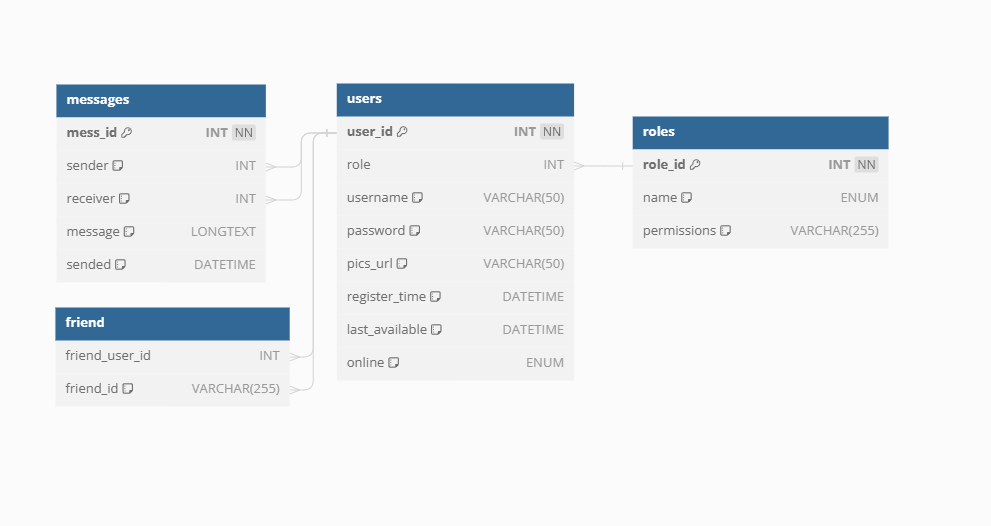

# Chat adatbázis

<figure><figcaption>
Adatbázis táblák és összefüggések
</figcaption></figure>

Az egész adatbázis karakter illesztése: utf8-_hungarian\_ci_

_users (user\_id, role, username, password, pics\_url, register\_time, last\_available, online)_

|    Mező neve    |          Adattípus, megszorításai         |                                                          Leírása                                                         |
| :-------------: | :---------------------------------------: | :----------------------------------------------------------------------------------------------------------------------: |
|     user\_id    |     INT, Primary Key, auto\_increment     |                                   Ez a felhasználónak az automatikusan kirendelt ID-ja                                   |
|       role      |                    INT                    |        Ez a mező a felhasználó jogosultságának a kapcsolója, ami csak egy szám típus és rámutat a role.role\_id-ra       |
|     username    |         VARCHAR(50), DEFAULT: NULL        |                     Ez a mező a felhasználó felhasználónevét fogja tárolni, amivel be tud jelentkezni                    |
|     password    |         VARCHAR(50), DEFAULT: NULL        |                                      Ez a mező a felhasználó jelszavát fogja tárolni                                     |
|    pics\_url    |        VARCHAR(255), DEFAULT: NULL        |                         Ez a mező a felhasználó profilképének az elérési útvonalát fogja tárolni                         |
|  register\_time |          DATETIME, DEFAULT: NOW()         |               Ez a mező a regisztrációs időt fogja tárolni, automatikusan a szerver idejét fogja használni               |
| last\_available |          DATETIME, DEFAULT: NULL          |                  Ez a mező a felhasználóról azt az adatot fogja eltárolni, amikor utoljára volt elérhető                 |
|      online     | ENUM (online\_status), DEFAULT: "offline" | Ez a mező a felhasználó elérhetőségi státuszát fogja eltárolni [(az enum állásait lásd leljebb)](./#enumeraciok-allasai) |

messages (mess\_id, sender, receiver, message, sended)

| Mező neve |     Adattípusa, megszorítással    |                              Leírása                             |
| :-------: | :-------------------------------: | :--------------------------------------------------------------: |
|  mess\_id | INT, Primary Key, auto\_increment |                 Minden üzenet kap egy saját ID-t                 |
|   sender  |         INT, DEFAULT: NULL        |    Az üzenet küldőjének az ID-ja, rámutat a users.user\_id-ra    |
|  receiver |         INT, DEFAULT: NULL        |    Az üzenet fogadójának az ID-ja, rámutat a users.user\_id-ra   |
|  message  |      LONGTEXT, DEFAULT: NULL      |            Itt tároljuk az üzenetet teljes formájában            |
|   sended  |      DATETIME, DEFAULT: NOW()     | Az üzenet elküldési ideje, a szerver jelenelegi idejét használja |

friend (friend\_user\_id, friend\_id)

|     Mező neve    | Adattípusa, megszorítással |                                 Leírása                                |
| :--------------: | :------------------------: | :--------------------------------------------------------------------: |
| friend\_user\_id |             INT            | A felhasználót bejelölő felhasználó ID-ja, rámutat a users.user\_id-ra |
|    friend\_id    |             INT            |        A bejelölt felhasználó ID-ja, rámutat a users.user\_id-ra       |

role (role\_id, name, permissions)

|   Mező neve  |     Adattípusa, megszorítással    |                                     Leírása                                    |
| :----------: | :-------------------------------: | :----------------------------------------------------------------------------: |
| role\_id[^1] | INT, Primary Key, auto\_Increment |                                 A jogkör ID-ja                                 |
|     name     |         ENUM (role\_list)         | A jogkör megnevezése [(az enum állásait lásd leljebb)](./#enumeraciok-allasai) |
|  permessions |            VARCHAR(255)           |                             A jogkör jogosultságai                             |

## Enumerációk állásai

* **online\_status**
  * offline
  * online
  * invisible
  * busy
  * not\_available
* **role\_list**
  * quest
  * user
  * supervisor
  * editor
  * developer

[^1]: 
